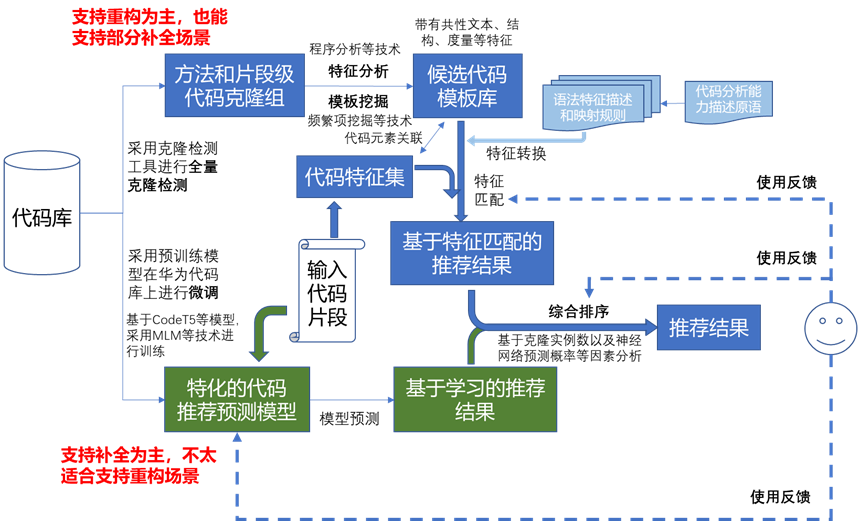

# 华为代码推荐项目

## 环境准备

- gradle: 7.6.1+
- java-jdk: 8+
- SAGACloneDetector-vGAP-2023.3.16.jar

## 基于代码克隆的模板挖掘

> 整体架构




### 1.构建代码克隆数据集


#### 输出文件

##### 方法级结果

**method_group10{groupId}.csv**

存放一个方法级克隆组的相关信息

```yaml
methodId: 方法id
CG_T3: type3 克隆组id，相同表示属于同一个组
CG_T2: type2 克隆组id，相同表示属于同一个组
CG_T1: type1 克隆组id，相同表示属于同一个组
tokenCsvId: saga检测结果的tokenCsvId
filePath: 原始文件路径
startLine: 原始文件中的起始行
endLine: 原始文件中的结束行
oriStartToken: saga检测结果的起始token
oriEndToken: saga检测结果的结束token
startToken: 同目录下token_csv文件中的起始token
endToken: 同目录下token_csv文件中的结束token
signature: 方法签名，常见结构：返回值 方法名(参数)
body: 方法的具体内容
```

**token_csv**

克隆组的原始token

##### 片段级结果

**method_group10{groupId}.csv**

存放一个片段级克隆组聚合后的所有组内方法的相关信息

```yaml
methodId: 方法id
groupId: type3 克隆组id，相同表示属于同一个组
tokenCsvId: saga检测结果的tokenCsvId
filePath: 原始文件路径
startLine: 原始文件中的起始行
endLine: 原始文件中的结束行
oriStartToken: saga检测结果的起始token
oriEndToken: saga检测结果的结束token
startToken: 同目录下token_csv文件中的起始token
endToken: 同目录下token_csv文件中的结束token
signature: 方法签名，常见结构：返回值 方法名(参数)
body: 方法的具体内容
```

**snippet_group10{groupId}.csv**

存放一个片段级克隆组聚合的相关信息

```yaml
snippetId: 片段id
methodId: 片段所属的方法id
groupId: 克隆组id，相同表示属于同一个组
type: 该克隆组的克隆类型(12/3) {PS:type3表示至少有两组type12片段聚合后的结果，也就是包含了模板的克隆组，一般该组可包含了哪些type12可以由起止token判断}
startLine: 原始文件中的起始行
endLine: 原始文件中的结束行
startToken: 同目录下token_csv文件中的起始token
endToken: 同目录下token_csv文件中的结束token
body: 片段的具体内容（目前未作）
```

**token_csv**

克隆组的原始token

### 2.代码特征提取与索引构建


## 配置文件

### 1. construct.yml

```yaml
process-construct: true

code-base:
  process: true #是否执行代码库构建
  repo-path: '/path/to/code/repository' #待建立索引的原始代码仓位置
  thread-num: 20 #多线程处理时的线程数限制
  sep-num: 1000 #构建代码库时的目录分割单位，每多少个克隆组放在同一个文件夹下，如group id为2023的片段级克隆组此时路径为 codebase/snippet/2/2023

  clone:
    detect: false #是否执行SAGA克隆检测
    saga-path: 'tools/saga/SAGACloneDetector-GAP-2023.3.16.jar' #SAGA的路径

clone:
  detect:
    saga:
      config: #saga克隆检测的相关配置
        language: 'java'
        extensions: 'java'
        threshold: 0.7f
        mlc: 50
        mlcc: 20
        min-line: 2
        sep-num: 100000000
        exe: './executable/executable_gpu_win10.exe'
        open-string-hash: 1
        use-long-type: 0
        tokenize: 1
        thread-num: 8

data-base:
  process: false #是否执行步骤-根据代码克隆库进行索引构建并入库
```


**注意**

ubuntu20上执行打包后的jar包时，需要添加参数

```
java -Dspring.config.additional-location=construct.yml -jar recommend.jar
```

或把construct.yml文件中的配置复制到application.yml中
